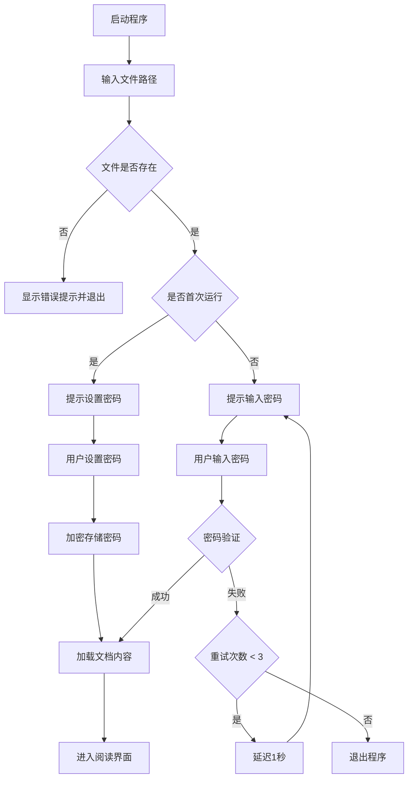
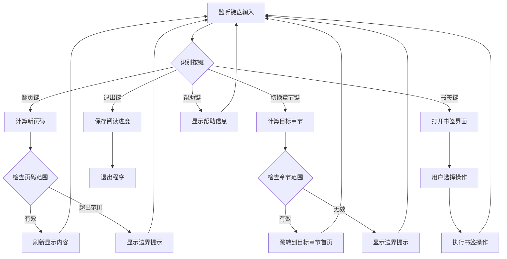
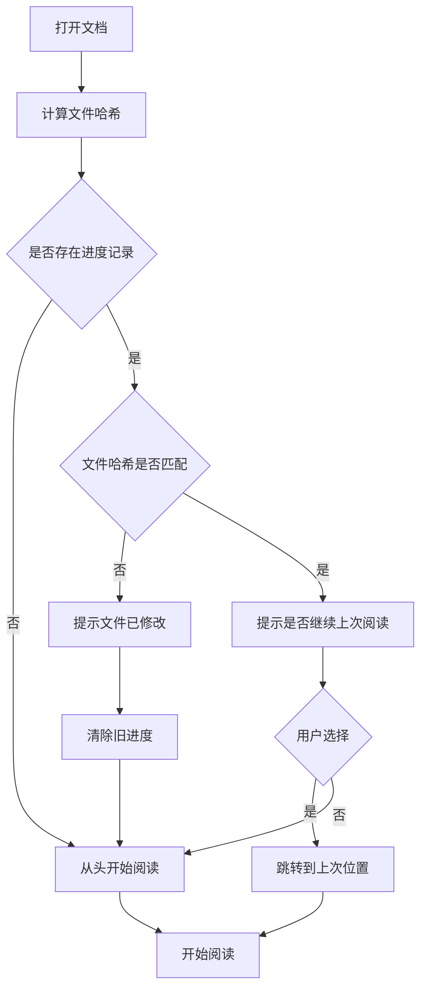
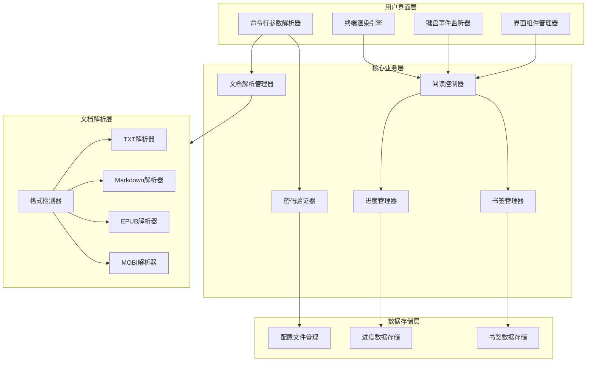
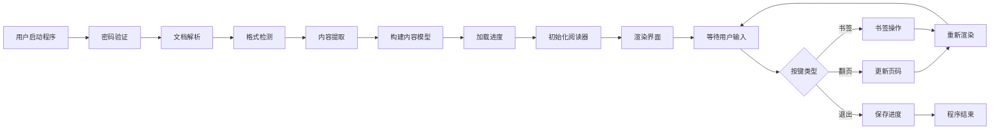
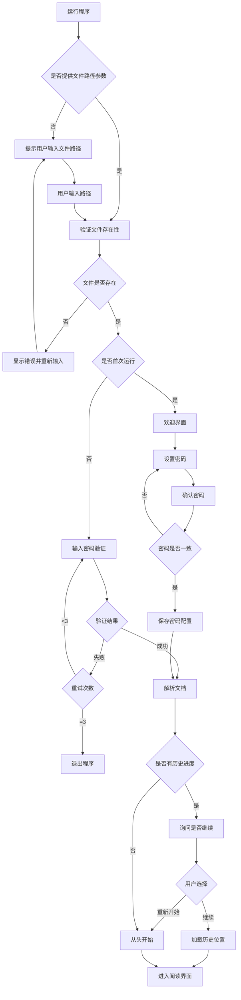
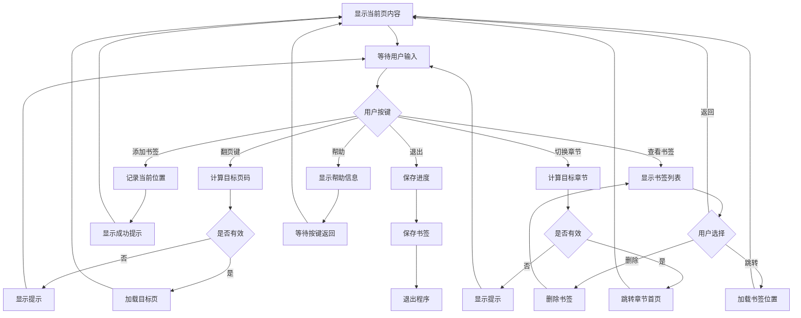

# 命令行文档阅读工具设计文档

## 1. 项目概述

### 1.1 项目目标
开发一个支持在命令行环境下阅读多种格式文档的工具，提供流畅的阅读体验和基本的安全保护机制。

### 1.2 核心功能
- 支持多种文档格式：EPUB、TXT、MOBI、Markdown
- 交互式阅读界面，支持快捷键操作
- 统一密码保护机制
- 阅读进度保存与恢复
- 书签管理功能

### 1.3 技术选型
- **开发语言**：Python 3.8+
- **理由**：
  - 丰富的文档解析库生态（ebooklib、mobi、markdown等）
  - 强大的终端UI库支持（如 curses、rich）
  - 跨平台兼容性好
  - 开发效率高

## 2. 功能设计

### 2.1 文档格式支持

#### 2.1.1 支持的格式及解析策略

| 格式 | 解析目标 | 主要挑战 | 解析策略 |
|------|---------|---------|---------|
| TXT | 纯文本内容 | 编码检测 | 自动检测编码（UTF-8、GBK、GB2312等），按终端行数分页 |
| Markdown | 格式化文本 | 渲染样式 | 解析Markdown语法，保留基本格式（标题、列表、代码块等），转换为终端可显示样式 |
| EPUB | 结构化电子书 | ZIP压缩、HTML/XML解析 | 解压EPUB文件，提取HTML内容，解析章节结构，去除HTML标签，转换为纯文本展示 |
| MOBI | Kindle格式电子书 | 二进制格式复杂 | 使用专用库解析MOBI二进制结构，提取文本内容和章节信息 |

#### 2.1.2 统一内容模型
所有格式的文档解析后转换为统一的内容模型：
- **文档元数据**：标题、作者、语言等
- **章节列表**：包含章节标题和内容
- **分页内容**：按终端窗口大小动态分页
- **总页数**：根据终端尺寸计算的总页数

### 2.2 密码保护机制

#### 2.2.1 密码验证流程



#### 2.2.2 密码管理策略
- **密码类型**：统一密码，所有文档共用
- **首次使用**：第一次运行时提示用户设置密码
- **密码存储**：使用配置文件存储加密后的密码哈希值
- **验证方式**：每次打开文档都需要输入密码验证
- **安全措施**：
  - 使用 SHA-256 算法进行密码哈希
  - 添加随机盐值（salt）增强安全性
  - 输入密码时终端不显示字符
  - 最多允许 3 次密码错误尝试
  - 密码错误后延迟 1 秒再允许重试，防止暴力破解

#### 2.2.3 配置文件结构

| 字段名 | 类型 | 说明 | 示例值 |
|--------|------|------|--------|
| password_hash | 字符串 | SHA-256哈希值 | e3b0c44298fc1c149afbf4c8996fb92427ae41e4649b934ca495991b7852b855 |
| salt | 字符串 | 密码加盐值 | a1b2c3d4e5f6 |
| created_at | 时间戳 | 密码创建时间 | 2024-01-01T00:00:00Z |
| updated_at | 时间戳 | 密码最后修改时间 | 2024-01-01T00:00:00Z |

### 2.3 阅读界面设计

#### 2.3.1 界面布局
终端界面分为三个区域：

```
┌─────────────────────────────────────────────────┐
│ 标题栏: 文档名称 | 章节 X/Y | 页码 A/B | 45%   │
├─────────────────────────────────────────────────┤
│                                                 │
│              文档内容显示区域                    │
│           (自动适配终端窗口大小)                 │
│                                                 │
│                                                 │
│                                                 │
├─────────────────────────────────────────────────┤
│ 状态栏: [=====>     ] ↑/↓翻页 q退出 ?帮助     │
└─────────────────────────────────────────────────┘
```

#### 2.3.2 显示信息设计

**标题栏信息**：
- 文档标题（截断过长标题，最多显示30字符）
- 当前章节序号/总章节数
- 当前页码/总页数
- 阅读进度百分比

**内容区域**：
- 动态计算可显示行数（终端高度 - 标题栏 - 状态栏 - 边距）
- 自动换行处理，保持文本完整性
- 保留基本格式（段落缩进、列表符号、标题等）
- 支持中英文混排显示

**状态栏信息**：
- 文本进度条（如：[=====>     ] 45%）
- 常用快捷键提示（紧凑显示）

### 2.4 交互控制设计

#### 2.4.1 快捷键映射表

| 快捷键 | 功能 | 说明 |
|--------|------|------|
| ↓ 或 j 或 Space | 下一页 | 向下翻页 |
| ↑ 或 k | 上一页 | 向上翻页 |
| → 或 l | 下一章 | 跳转到下一章节首页 |
| ← 或 h | 上一章 | 跳转到上一章节首页 |
| g | 跳转到开头 | 回到文档第一页 |
| G | 跳转到结尾 | 跳到文档最后一页 |
| b | 书签管理 | 打开书签管理界面 |
| m | 添加书签 | 在当前位置添加书签 |
| ? 或 h | 帮助 | 显示所有快捷键说明 |
| q 或 ESC | 退出 | 保存进度并退出阅读器 |

#### 2.4.2 快捷键处理流程



### 2.5 书签管理功能

#### 2.5.1 书签数据结构

| 字段名 | 类型 | 说明 |
|--------|------|------|
| id | 整数 | 书签唯一标识 |
| page_number | 整数 | 书签页码 |
| chapter_index | 整数 | 所在章节索引 |
| chapter_name | 字符串 | 所在章节名称 |
| preview_text | 字符串 | 预览文本（前50字符） |
| created_at | 时间戳 | 创建时间 |
| note | 字符串 | 用户备注（可选） |

#### 2.5.2 书签管理界面

```
┌─────────────────────────────────────────────────┐
│              书签列表 (共 3 个)                  │
├─────────────────────────────────────────────────┤
│  1. 第一章 - 页码 5                             │
│     "这是一段预览文本内容..."                    │
│     创建时间: 2024-01-15 10:30                   │
│                                                 │
│  2. 第三章 - 页码 45                            │
│     "另一段预览文本..."                          │
│     创建时间: 2024-01-15 14:20                   │
│                                                 │
│  3. 第五章 - 页码 89                            │
│     "第三个书签的预览..."                        │
│     创建时间: 2024-01-16 09:00                   │
├─────────────────────────────────────────────────┤
│ Enter跳转 d删除 ESC返回                         │
└─────────────────────────────────────────────────┘
```

#### 2.5.3 书签操作
- **添加书签**：按 m 键在当前页添加书签，自动记录页码、章节、预览文本
- **查看书签**：按 b 键打开书签列表
- **跳转书签**：在书签列表中选择书签并回车跳转
- **删除书签**：在书签列表中选择书签并按 d 键删除
- **书签限制**：每个文档最多保存 50 个书签

### 2.6 阅读进度管理

#### 2.6.1 进度数据模型

| 字段名 | 类型 | 说明 |
|--------|------|------|
| file_path | 字符串 | 文档文件绝对路径 |
| file_hash | 字符串 | 文件MD5哈希值（用于验证文件未被修改） |
| file_name | 字符串 | 文件名 |
| current_page | 整数 | 当前阅读页码 |
| current_chapter | 整数 | 当前章节索引 |
| total_pages | 整数 | 总页数 |
| total_chapters | 整数 | 总章节数 |
| last_read_time | 时间戳 | 最后阅读时间 |
| bookmarks | 列表 | 书签列表 |
| read_percentage | 浮点数 | 阅读进度百分比 |

#### 2.6.2 进度保存策略
- **保存时机**：
  - 正常退出时自动保存
  - 翻页操作后延迟 2 秒保存（防止频繁IO）
  - 切换章节时立即保存
  - 添加书签时立即保存
- **存储位置**：用户主目录下的配置文件夹
  - Linux/Mac: `~/.ibook_reader/progress.json`
  - Windows: `%USERPROFILE%\.ibook_reader\progress.json`
- **数据格式**：JSON格式存储，便于读取和调试
- **恢复机制**：
  - 打开文档时检查是否有保存的进度
  - 如果有，提示用户是否从上次位置继续阅读
  - 验证文件哈希，如果文件被修改则忽略旧进度

#### 2.6.3 进度恢复流程



## 3. 系统架构设计

### 3.1 模块划分



### 3.2 核心模块说明

#### 3.2.1 文档解析管理器
- **职责**：
  - 识别文档格式
  - 调用相应的解析器
  - 将解析结果转换为统一的内容模型
  - 管理文档元数据
- **输入**：文档文件路径
- **输出**：标准化的文档内容对象

#### 3.2.2 密码验证器
- **职责**：
  - 首次运行时引导用户设置密码
  - 验证用户输入的密码
  - 管理密码配置文件
  - 提供密码重置功能
- **安全要求**：
  - 密码不以明文形式存储
  - 使用加盐哈希算法
  - 限制密码尝试次数

#### 3.2.3 阅读控制器
- **职责**：
  - 管理当前阅读状态（页码、章节）
  - 处理翻页逻辑
  - 计算分页内容
  - 协调界面渲染
  - 响应用户快捷键操作
- **核心状态**：
  - 当前文档对象
  - 当前页码
  - 当前章节
  - 窗口尺寸
  - 分页缓存

#### 3.2.4 书签管理器
- **职责**：
  - 添加新书签
  - 查询书签列表
  - 删除指定书签
  - 书签持久化存储
  - 书签数量限制管理
- **数据关联**：与具体文档关联，通过文件路径或哈希值识别

#### 3.2.5 进度管理器
- **职责**：
  - 保存阅读进度
  - 恢复历史进度
  - 验证进度有效性
  - 管理多个文档的进度
- **优化策略**：
  - 延迟保存机制减少IO
  - 内存缓存当前进度
  - 定期清理过期进度数据

### 3.3 数据流设计



## 4. 技术实现要点

### 4.1 终端处理

#### 4.1.1 终端库选择
- **推荐库**：`curses`（Python标准库）或 `rich`（现代化终端UI库）
- **选择依据**：
  - curses: 跨平台、标准库、稳定可靠
  - rich: 美观、功能丰富、易于使用

#### 4.1.2 窗口尺寸适配
- 启动时获取终端窗口尺寸（行数、列数）
- 监听窗口尺寸变化事件
- 窗口变化时重新计算分页
- 动态调整内容显示

#### 4.1.3 字符编码处理
- 统一使用 UTF-8 编码处理内部文本
- 自动检测输入文件编码
- 处理中英文混排的对齐问题
- 正确计算中文字符宽度（占2个字符位）

### 4.2 文档解析

#### 4.2.1 格式检测策略
- **文件扩展名**：首选检测方式
- **文件头魔数**：辅助验证（EPUB为ZIP格式，MOBI有特定头部）
- **内容探测**：尝试解析前几个字节判断格式
- **降级处理**：无法识别时按纯文本处理

#### 4.2.2 解析器实现要点

**TXT解析器**：
- 使用 `chardet` 库自动检测编码
- 按行读取，按终端行数分页
- 处理不同操作系统的换行符（\n, \r\n, \r）

**Markdown解析器**：
- 使用 `markdown` 或 `mistune` 库解析
- 保留标题层级（用符号标识，如 #、##）
- 保留列表结构（项目符号）
- 代码块使用缩进显示
- 移除或简化不支持的格式（图片、表格等）

**EPUB解析器**：
- 使用 `ebooklib` 库
- 解压ZIP文件
- 解析 OPF 文件获取目录结构
- 提取 HTML/XHTML 内容
- 去除 HTML 标签，保留纯文本
- 识别章节分隔

**MOBI解析器**：
- 使用 `mobi` 或 `unpackmobi` 库
- 解析 MOBI 头部获取元数据
- 提取 HTML 内容
- 处理 Kindle 特有格式
- 转换为纯文本

### 4.3 分页算法

#### 4.3.1 分页计算逻辑
- **可用行数** = 终端总行数 - 标题栏行数 - 状态栏行数 - 上下边距
- **可用列数** = 终端总列数 - 左右边距
- **中文字符处理**：一个中文字符占用 2 个显示位置
- **自动换行**：超过可用列数时自动换行
- **段落保持**：尽量避免在段落中间分页

#### 4.3.2 分页策略
- **预分页**：文档加载后预先计算所有分页
- **缓存机制**：缓存已计算的页面内容
- **动态调整**：窗口尺寸变化时重新分页
- **性能优化**：大文档采用按需分页，只计算当前页及前后几页

### 4.4 数据持久化

#### 4.4.1 存储结构
```
~/.ibook_reader/
├── config.json          # 密码配置
├── progress.json        # 阅读进度
└── bookmarks/           # 书签数据
    ├── <file_hash1>.json
    ├── <file_hash2>.json
    └── ...
```

#### 4.4.2 配置文件格式示例

**config.json**：
```
{
  "password_hash": "...",
  "salt": "...",
  "created_at": "2024-01-01T00:00:00Z",
  "version": "1.0"
}
```

**progress.json**：
```
{
  "documents": [
    {
      "file_path": "/path/to/book.epub",
      "file_hash": "abc123...",
      "current_page": 45,
      "current_chapter": 3,
      "last_read_time": "2024-01-15T10:30:00Z"
    }
  ]
}
```

**bookmarks/<file_hash>.json**：
```
{
  "file_path": "/path/to/book.epub",
  "bookmarks": [
    {
      "id": 1,
      "page_number": 10,
      "chapter_index": 1,
      "chapter_name": "第一章",
      "preview_text": "这是预览文本...",
      "created_at": "2024-01-15T10:30:00Z"
    }
  ]
}
```

### 4.5 异常处理

#### 4.5.1 文件访问异常
- **文件不存在**：提示用户文件路径错误
- **权限不足**：提示用户检查文件权限
- **文件格式错误**：提示不支持的格式或文件损坏
- **编码错误**：尝试多种编码，失败后提示用户

#### 4.5.2 运行时异常
- **终端尺寸过小**：提示用户调整终端窗口大小（最小要求：24行x80列）
- **配置文件损坏**：备份后重新初始化配置
- **内存不足**：对于超大文件采用流式读取
- **键盘中断**：捕获 Ctrl+C，保存进度后优雅退出

## 5. 用户交互流程

### 5.1 启动流程



### 5.2 阅读流程



### 5.3 帮助信息界面

```
┌─────────────────────────────────────────────────┐
│                  快捷键帮助                      │
├─────────────────────────────────────────────────┤
│                                                 │
│  导航操作：                                      │
│    ↓ / j / Space    下一页                      │
│    ↑ / k            上一页                      │
│    → / l            下一章                      │
│    ← / h            上一章                      │
│    g                跳转到开头                   │
│    G                跳转到结尾                   │
│                                                 │
│  书签操作：                                      │
│    m                在当前位置添加书签            │
│    b                查看和管理书签列表            │
│                                                 │
│  其他操作：                                      │
│    ? / h            显示此帮助信息               │
│    q / ESC          保存并退出                   │
│                                                 │
├─────────────────────────────────────────────────┤
│          按任意键返回阅读界面                     │
└─────────────────────────────────────────────────┘
```

## 6. 性能优化策略

### 6.1 文档解析优化
- **延迟解析**：只解析当前章节及相邻章节内容
- **流式读取**：对于超大文件（>10MB）采用流式读取，避免全部加载到内存
- **缓存机制**：缓存已解析的章节内容，避免重复解析
- **异步加载**：后台预加载下一章节内容

### 6.2 渲染优化
- **差异渲染**：只更新变化的区域，减少终端刷新
- **双缓冲**：使用双缓冲技术减少闪烁
- **内容缓存**：缓存当前页及前后页的渲染结果

### 6.3 存储优化
- **延迟写入**：进度数据延迟写入，避免频繁IO
- **增量保存**：只保存变化的数据
- **定期清理**：自动清理30天未访问的进度记录
- **压缩存储**：书签和进度数据使用JSON压缩格式

## 7. 扩展性设计

### 7.1 插件化解析器
- **解析器接口**：定义统一的文档解析器接口
- **动态注册**：支持运行时注册新的格式解析器
- **格式扩展**：便于未来添加PDF、DOCX等格式支持

### 7.2 主题系统
- **配置化主题**：支持通过配置文件自定义颜色方案
- **预设主题**：提供多种预设主题（暗色、亮色、护眼等）
- **终端适配**：根据终端能力自动调整显示效果

### 7.3 配置系统
- **用户配置**：允许用户自定义快捷键、显示参数等
- **配置文件**：支持通过配置文件修改默认行为
- **命令行参数**：支持通过命令行参数覆盖配置

## 8. 安全性考虑

### 8.1 密码安全
- **哈希算法**：使用 SHA-256 或更强的哈希算法
- **加盐处理**：每次设置密码生成随机盐值
- **防暴力破解**：限制密码尝试次数和重试间隔
- **密码强度**：建议用户设置强密码（可选：强制要求最小长度）

### 8.2 文件安全
- **路径验证**：验证文件路径合法性，防止路径遍历攻击
- **权限检查**：检查文件读取权限
- **文件验证**：使用哈希值验证文件完整性

### 8.3 数据隐私
- **本地存储**：所有数据存储在本地，不上传到网络
- **权限控制**：配置文件设置合理的文件权限（仅用户可读写）
- **敏感信息**：不在日志中记录密码等敏感信息

## 9. 测试策略

### 9.1 功能测试
- **格式支持**：测试所有支持格式的解析正确性
- **快捷键**：测试所有快捷键功能
- **边界条件**：测试空文件、单页文件、超大文件等边界情况
- **书签功能**：测试书签的添加、删除、跳转
- **进度保存**：测试进度的保存和恢复

### 9.2 兼容性测试
- **终端兼容**：在不同终端模拟器中测试（iTerm、Terminal、cmd、PowerShell等）
- **平台兼容**：在 Linux、macOS、Windows 上测试
- **编码兼容**：测试不同编码的文本文件（UTF-8、GBK、GB2312等）
- **窗口尺寸**：测试不同终端窗口尺寸下的显示

### 9.3 性能测试
- **大文件处理**：测试大文件（>100MB）的加载和翻页性能
- **内存占用**：监控长时间运行的内存占用
- **响应速度**：测试快捷键响应延迟

### 9.4 安全测试
- **密码验证**：测试密码验证的正确性和安全性
- **异常输入**：测试各种异常输入和边界条件
- **文件路径**：测试特殊字符和路径遍历

## 10. 部署说明

### 10.1 依赖管理
- **依赖列表**：明确列出所有第三方库依赖
- **版本锁定**：使用版本锁定文件确保环境一致性
- **最小依赖**：尽量减少外部依赖，优先使用标准库

### 10.2 打包方式
- **源码安装**：通过 pip 或 setup.py 安装
- **可执行文件**：使用 PyInstaller 打包为单文件可执行程序
- **跨平台**：为 Linux、macOS、Windows 分别打包

### 10.3 安装流程
- **快速安装**：提供一键安装脚本
- **首次配置**：首次运行自动创建配置目录和初始化密码
- **升级处理**：版本升级时兼容旧配置文件

### 10.4 使用文档
- **命令行帮助**：提供详细的命令行帮助信息
- **README**：编写清晰的 README 文档
- **示例演示**：提供使用示例和截图
