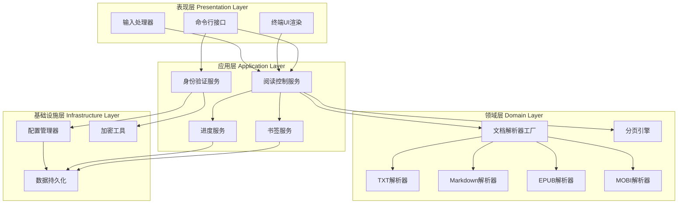
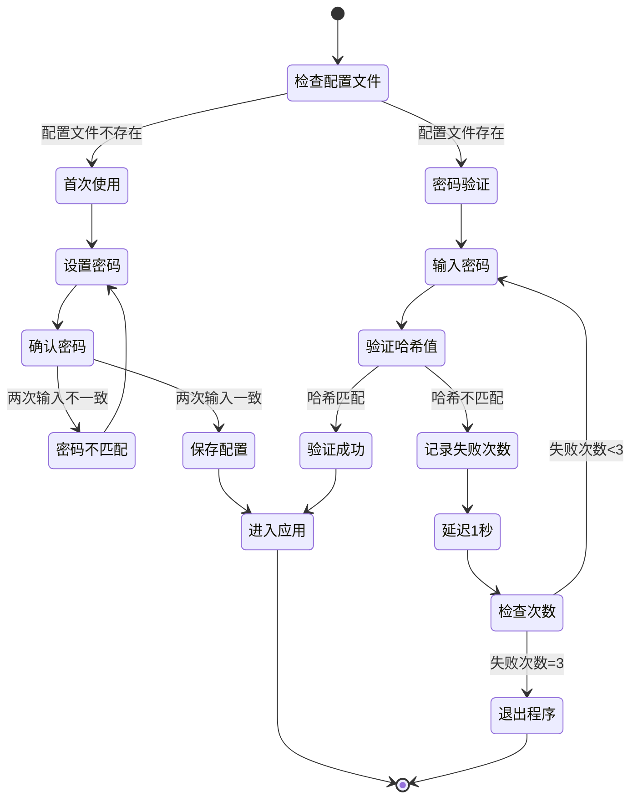
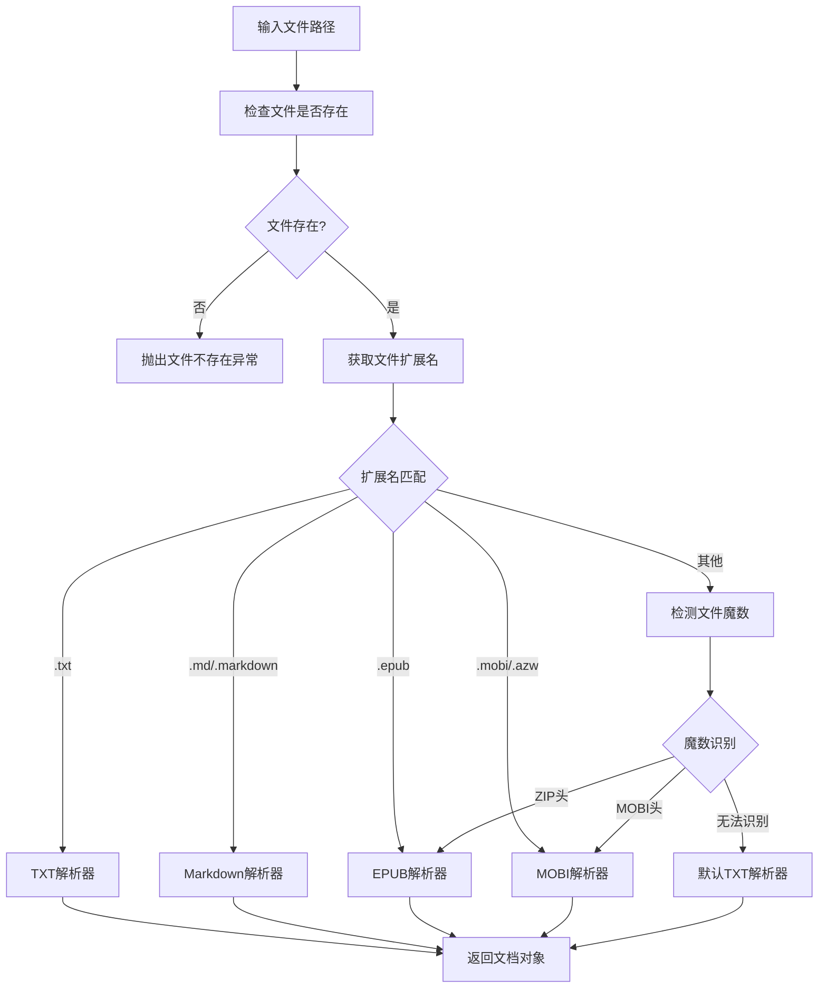
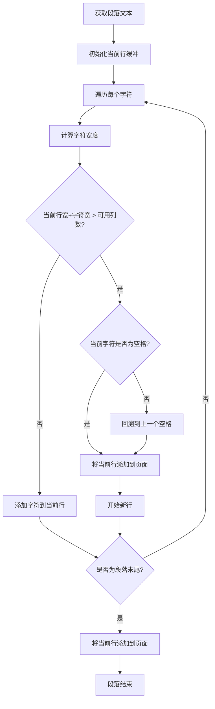
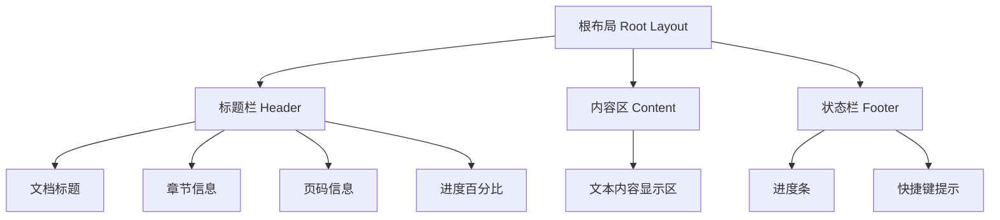
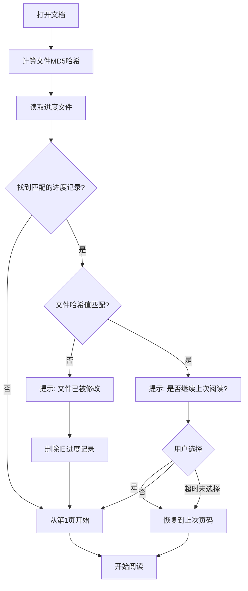

# iBookRead 命令行文档阅读工具技术实施方案

## 1. 项目概况

### 1.1 项目定位
基于 Python 3.8+ 开发的跨平台命令行文档阅读工具，支持 EPUB、TXT、MOBI、Markdown 等多种文档格式，提供流畅的终端阅读体验。

### 1.2 核心价值
- 轻量级：纯命令行界面，资源占用低
- 安全性：统一密码保护机制
- 便捷性：阅读进度自动保存，书签快速定位
- 跨平台：支持 Linux、macOS、Windows

### 1.3 技术栈确定

| 技术类别 | 选型 | 版本要求 | 选型理由 |
|---------|------|---------|---------|
| 开发语言 | Python | 3.8+ | 丰富的库生态、跨平台支持好 |
| 终端UI框架 | rich | 13.0+ | 现代化UI、易用性强、美观度高 |
| 文本编码检测 | chardet | 5.0+ | 自动检测多种文本编码 |
| EPUB解析 | ebooklib | 0.18+ | 成熟的EPUB解析库 |
| MOBI解析 | mobi | 0.3+ | 支持MOBI格式解析 |
| Markdown解析 | markdown | 3.4+ | 标准Markdown解析器 |
| 密码哈希 | hashlib | 标准库 | SHA-256加密算法 |
| 文件操作 | pathlib | 标准库 | 现代化路径处理 |
| JSON处理 | json | 标准库 | 配置和数据存储 |

## 2. 系统架构设计

### 2.1 分层架构

系统采用经典的分层架构模式，自顶向下分为四层：



### 2.2 核心模块职责

| 模块名称 | 层级 | 职责描述 |
|---------|------|---------|
| CLI接口 | 表现层 | 处理命令行参数，启动应用程序 |
| 终端UI渲染 | 表现层 | 使用rich库渲染阅读界面、书签列表、帮助信息 |
| 输入处理器 | 表现层 | 监听并处理键盘事件 |
| 身份验证服务 | 应用层 | 管理密码设置、验证、重试逻辑 |
| 阅读控制服务 | 应用层 | 协调文档加载、翻页、章节跳转等核心阅读逻辑 |
| 书签服务 | 应用层 | 管理书签的增删查改操作 |
| 进度服务 | 应用层 | 管理阅读进度的保存和恢复 |
| 文档解析器工厂 | 领域层 | 根据文件类型创建对应的解析器实例 |
| 各格式解析器 | 领域层 | 将特定格式文档转换为统一内容模型 |
| 分页引擎 | 领域层 | 根据终端尺寸计算分页 |
| 配置管理器 | 基础设施层 | 管理应用配置文件的读写 |
| 数据持久化 | 基础设施层 | 处理进度、书签数据的存储 |
| 加密工具 | 基础设施层 | 提供密码哈希和验证功能 |

### 2.3 数据模型设计

#### 2.3.1 文档内容模型

| 字段名 | 数据类型 | 必填 | 说明 |
|--------|---------|------|------|
| title | 字符串 | 是 | 文档标题 |
| author | 字符串 | 否 | 作者信息 |
| language | 字符串 | 否 | 文档语言 |
| chapters | 章节列表 | 是 | 章节数组 |
| metadata | 字典 | 否 | 其他元数据 |

**章节模型**：

| 字段名 | 数据类型 | 必填 | 说明 |
|--------|---------|------|------|
| index | 整数 | 是 | 章节序号（从0开始） |
| title | 字符串 | 是 | 章节标题 |
| content | 字符串 | 是 | 章节纯文本内容 |
| start_position | 整数 | 是 | 在全文中的起始位置 |

#### 2.3.2 阅读状态模型

| 字段名 | 数据类型 | 说明 |
|--------|---------|------|
| document | 文档对象 | 当前加载的文档 |
| current_page | 整数 | 当前页码（从1开始） |
| current_chapter | 整数 | 当前章节索引（从0开始） |
| total_pages | 整数 | 总页数 |
| terminal_rows | 整数 | 终端可用行数 |
| terminal_cols | 整数 | 终端可用列数 |
| pages_cache | 列表 | 分页内容缓存 |

#### 2.3.3 书签数据模型

| 字段名 | 数据类型 | 说明 |
|--------|---------|------|
| id | 整数 | 唯一标识（自增） |
| page_number | 整数 | 书签所在页码 |
| chapter_index | 整数 | 所在章节索引 |
| chapter_name | 字符串 | 章节名称 |
| preview_text | 字符串 | 预览文本（最多50字符） |
| created_at | ISO时间戳 | 创建时间 |
| note | 字符串 | 用户备注（可选，暂不实现） |

#### 2.3.4 进度数据模型

| 字段名 | 数据类型 | 说明 |
|--------|---------|------|
| file_path | 字符串 | 文档文件绝对路径 |
| file_hash | 字符串 | 文件MD5哈希值 |
| file_name | 字符串 | 文件名 |
| current_page | 整数 | 当前页码 |
| current_chapter | 整数 | 当前章节索引 |
| total_pages | 整数 | 总页数 |
| total_chapters | 整数 | 总章节数 |
| last_read_time | ISO时间戳 | 最后阅读时间 |
| read_percentage | 浮点数 | 阅读百分比 |

## 3. 核心功能实现策略

### 3.1 密码保护机制

#### 3.1.1 密码存储策略
- 使用 SHA-256 算法对密码进行哈希
- 为每个密码生成16字节随机盐值
- 将哈希值和盐值存储在配置文件中
- 密码输入时使用 getpass 模块隐藏输入字符

#### 3.1.2 密码验证流程



#### 3.1.3 配置文件结构

存储路径：
- Linux/macOS: `~/.ibook_reader/config.json`
- Windows: `%USERPROFILE%\.ibook_reader\config.json`

配置内容结构：

| 字段 | 类型 | 说明 |
|-----|------|------|
| password_hash | 字符串 | SHA-256哈希值（十六进制字符串） |
| salt | 字符串 | 随机盐值（十六进制字符串） |
| created_at | 字符串 | 密码创建时间（ISO 8601格式） |
| updated_at | 字符串 | 密码最后更新时间 |
| version | 字符串 | 配置文件版本号 |

### 3.2 文档解析策略

#### 3.2.1 格式检测流程



#### 3.2.2 TXT解析策略

处理步骤：
1. 使用 chardet 库检测文件编码
2. 以检测到的编码读取文件内容
3. 统一转换为 UTF-8 内部处理
4. 将整个文件视为单章节
5. 保留原始换行符和段落结构

特殊处理：
- 检测并处理 BOM（Byte Order Mark）
- 处理不同操作系统的换行符（`\n`、`\r\n`、`\r`）
- 如果编码检测失败，依次尝试 UTF-8、GBK、GB2312、Latin1

#### 3.2.3 Markdown解析策略

处理步骤：
1. 使用 markdown 库解析 Markdown 语法
2. 提取文本内容的同时保留基本格式标记
3. 转换规则：
   - 标题：保留 `#` 符号，并在标题前后添加空行
   - 列表：保留 `-`、`*`、数字编号
   - 代码块：保留缩进，添加边框标识
   - 粗体/斜体：使用 `*` 或 `_` 标识
   - 链接：保留链接文本，去除URL
   - 图片：显示 `[图片: alt文本]`

章节划分：
- 以一级标题（`#`）作为章节分隔符
- 如果没有一级标题，则整个文档视为单章节

#### 3.2.4 EPUB解析策略

处理步骤：
1. 使用 ebooklib.epub 库加载 EPUB 文件
2. 读取 OPF 文件获取元数据（标题、作者等）
3. 读取 NCX 或 NAV 文件获取目录结构
4. 按目录顺序提取各章节的 HTML/XHTML 内容
5. 使用 html.parser 或 BeautifulSoup 去除 HTML 标签
6. 提取纯文本内容
7. 保留章节结构

特殊处理：
- 处理内嵌的CSS样式（忽略）
- 处理图片标签（显示提示文本）
- 处理特殊字符实体（如 `&nbsp;`）
- 合并章节内的多个 HTML 文件

#### 3.2.5 MOBI解析策略

处理步骤：
1. 使用 mobi 库提取 MOBI 文件内容
2. MOBI 文件本质是包含 HTML 的二进制格式
3. 提取 HTML 内容后与 EPUB 类似处理
4. 去除 HTML 标签，提取纯文本
5. 尝试识别章节分隔

降级策略：
- 如果 mobi 库解析失败，尝试将文件作为文本读取
- 无法解析时提示用户文件可能已损坏

### 3.3 分页引擎设计

#### 3.3.1 分页计算逻辑

可用显示区域计算：
- 可用行数 = 终端总行数 - 标题栏(1行) - 状态栏(1行) - 上下边框(2行) - 内边距(2行)
- 可用列数 = 终端总列数 - 左右边框(2列) - 内边距(4列)

字符宽度计算规则：
- ASCII字符：占1个显示宽度
- 中文字符（CJK字符）：占2个显示宽度
- 使用 `wcwidth` 或 `unicodedata` 计算字符显示宽度

#### 3.3.2 自动换行算法



换行规则：
- 优先在空格、标点处换行
- 避免在单词中间断开（英文）
- 中文可在任意字符间换行
- 保留段落间的空行

#### 3.3.3 分页策略

采用混合策略：
- 小文档（< 1000 行）：预先计算所有页面，缓存结果
- 大文档（>= 1000 行）：按需计算，缓存当前页及前后各3页

分页边界处理：
- 尽量避免在段落中间分页
- 如果段落过长必须分页，在段中分页时添加续行标识
- 章节开始总是从新页开始

窗口尺寸变化处理：
- 监听终端尺寸变化信号
- 重新计算所有分页
- 根据当前内容位置计算新的页码
- 刷新显示

### 3.4 阅读界面设计

#### 3.4.1 布局方案

使用 rich 库的 Layout 和 Panel 组件构建界面：



布局比例：
- 标题栏：固定1行
- 内容区：自适应（占据剩余空间）
- 状态栏：固定1行

#### 3.4.2 标题栏显示内容

格式模板：`[文档名] | 第X章/共Y章 | 第A页/共B页 | C%`

示例：`红楼梦.epub | 第3章/共120章 | 第45页/共523页 | 8.6%`

字段计算：
- 文档名：取文件名（不含扩展名），超过20字符时截断并添加省略号
- 当前章节/总章节：从阅读状态获取
- 当前页/总页：从分页结果获取
- 进度百分比：`(当前页 / 总页数) * 100`，保留1位小数

#### 3.4.3 内容区显示策略

文本渲染：
- 使用等宽字体确保对齐
- 保留段落缩进（通常为2个空格）
- 保留列表符号和编号
- 标题使用不同样式（加粗或不同颜色）

样式方案（基于 rich）：
- 标题：使用 bold 样式，前后添加空行
- 段落：正常样式
- 列表：保留缩进
- 代码块：使用不同背景色或边框

#### 3.4.4 状态栏显示内容

格式模板：`[进度条] | ↑/↓翻页 | ←/→切章 | m书签 | q退出`

进度条样式：`[=====>     ] 45%`
- 总长度：20个字符
- 已读部分：用 `=` 填充
- 当前位置：用 `>` 标识
- 未读部分：用空格填充

快捷键提示：
- 精简显示最常用的操作
- 根据终端宽度动态调整显示内容
- 终端宽度不足时隐藏部分提示

### 3.5 交互控制实现

#### 3.5.1 键盘事件监听

使用 rich 的 Live 组件和标准库的键盘输入：
- 进入阅读模式时设置终端为原始模式
- 监听键盘事件（阻塞式读取）
- 根据按键分发到对应的处理函数
- 退出时恢复终端正常模式

跨平台处理：
- Linux/macOS：使用 termios 和 tty 模块
- Windows：使用 msvcrt 模块
- 统一封装为跨平台的按键读取接口

#### 3.5.2 快捷键映射

| 按键 | 功能 | 处理逻辑 |
|-----|------|---------|
| ↓ / j / Space | 下一页 | current_page += 1，边界检查 |
| ↑ / k | 上一页 | current_page -= 1，边界检查 |
| → / l | 下一章 | chapter_index += 1，跳转到该章首页 |
| ← / h | 上一章 | chapter_index -= 1，跳转到该章首页 |
| g | 跳到开头 | current_page = 1 |
| G | 跳到结尾 | current_page = total_pages |
| m | 添加书签 | 调用书签服务添加当前位置书签 |
| b | 书签列表 | 显示书签管理界面 |
| ? | 帮助 | 显示快捷键帮助面板 |
| q / ESC | 退出 | 保存进度并退出程序 |

边界处理：
- 翻页超出范围时显示提示（如"已到达文档开头"）
- 章节切换超出范围时停留在当前章节
- 所有边界提示停留1秒后自动消失

#### 3.5.3 书签管理界面

显示模式：
- 使用 rich 的 Table 组件展示书签列表
- 列包括：序号、章节名称、页码、预览文本、创建时间
- 支持上下键选择书签
- 支持快捷键操作

交互流程：
1. 按 `b` 键进入书签列表
2. 使用 ↑/↓ 键选择书签
3. 按 Enter 键跳转到选中的书签位置
4. 按 `d` 键删除选中的书签
5. 按 ESC 键返回阅读界面

书签列表为空时：
- 显示提示："暂无书签，按 m 键添加书签"
- 按任意键返回阅读界面

### 3.6 书签功能实现

#### 3.6.1 书签存储结构

存储路径：`~/.ibook_reader/bookmarks/<file_hash>.json`

使用文件哈希值命名的优势：
- 避免文件路径变化导致书签丢失
- 防止文件名冲突
- 便于清理无效书签

文件内容结构：

| 字段 | 类型 | 说明 |
|-----|------|------|
| file_path | 字符串 | 原始文件路径（用于显示） |
| file_name | 字符串 | 文件名 |
| file_hash | 字符串 | MD5哈希值 |
| bookmarks | 数组 | 书签列表 |

#### 3.6.2 书签操作

添加书签：
- 记录当前页码、章节索引、章节名称
- 从当前页提取前50个字符作为预览
- 记录创建时间
- 检查书签数量限制（最多50个）
- 保存到文件

删除书签：
- 从书签列表中移除指定ID的书签
- 更新书签文件
- 如果书签列表为空，删除书签文件

跳转书签：
- 根据书签中的页码设置当前页
- 刷新阅读界面
- 显示跳转成功提示

### 3.7 阅读进度管理

#### 3.7.1 进度存储结构

存储路径：`~/.ibook_reader/progress.json`

文件内容结构（存储多个文档的进度）：

```
{
  "version": "1.0",
  "documents": [
    {
      文档进度对象
    },
    ...
  ]
}
```

#### 3.7.2 进度保存时机

触发条件：
- 翻页操作后延迟2秒保存（防抖）
- 切换章节时立即保存
- 添加书签时立即保存
- 正常退出时立即保存
- 窗口尺寸变化重新分页后保存

防抖机制：
- 使用定时器延迟保存
- 如果2秒内再次翻页，重置定时器
- 确保连续翻页时不会频繁IO

#### 3.7.3 进度恢复流程



用户提示策略：
- 显示上次阅读时间和页码信息
- 默认选择"继续阅读"
- 5秒后自动选择默认选项
- 支持 y/n 键快速选择

进度验证：
- 检查页码是否在有效范围内
- 检查章节索引是否有效
- 如果验证失败，从第1页开始

## 4. 数据持久化方案

### 4.1 存储目录结构

```
~/.ibook_reader/
├── config.json              # 密码配置
├── progress.json            # 阅读进度
└── bookmarks/               # 书签目录
    ├── abc123def456.json    # 文件哈希命名的书签文件
    ├── 789ghi012jkl.json
    └── ...
```

### 4.2 文件读写策略

原子写入：
- 先写入临时文件（.tmp后缀）
- 写入成功后重命名为目标文件
- 确保写入过程中不会损坏原文件

错误处理：
- 读取失败时使用默认值
- 写入失败时记录日志但不中断程序
- 配置文件损坏时提示用户重新初始化

备份策略：
- 配置文件修改前备份为 .bak 文件
- 最多保留最近1个备份
- 恢复时优先使用备份文件

### 4.3 数据清理策略

自动清理规则：
- 启动时检查进度文件中的记录
- 删除30天未访问的进度记录
- 删除对应文件不存在的书签文件
- 删除空的书签文件

手动清理：
- 提供命令行参数 `--clean` 清理所有数据
- 提供 `--reset-password` 重置密码

## 5. 异常处理策略

### 5.1 文件相关异常

| 异常类型 | 处理策略 | 用户提示 |
|---------|---------|---------|
| FileNotFoundError | 提示错误并退出 | "错误：文件不存在" |
| PermissionError | 提示权限不足并退出 | "错误：没有读取文件的权限" |
| UnicodeDecodeError | 尝试其他编码 | "警告：文件编码检测失败，使用默认编码" |
| 文件过大（>100MB） | 警告但继续 | "警告：文件较大，加载可能需要一些时间" |

### 5.2 终端相关异常

| 异常情况 | 处理策略 | 用户提示 |
|---------|---------|---------|
| 终端尺寸过小 | 提示并退出 | "错误：终端窗口太小，请至少调整到 24行x80列" |
| 终端不支持颜色 | 降级为纯文本模式 | 无提示，自动适配 |
| 键盘中断（Ctrl+C） | 捕获信号，保存进度后退出 | "正在保存进度..." |

### 5.3 运行时异常

| 异常类型 | 处理策略 | 用户提示 |
|---------|---------|---------|
| 内存不足 | 降级为按需加载模式 | "警告：内存不足，使用流式加载模式" |
| 解析失败 | 记录错误，提示用户 | "错误：无法解析文档，可能文件已损坏" |
| 配置文件损坏 | 使用备份或重建 | "警告：配置文件损坏，已重新初始化" |
| 书签文件损坏 | 忽略该文件 | "警告：书签数据损坏，已忽略" |

### 5.4 异常日志记录

日志策略：
- 使用 Python logging 模块
- 日志文件：`~/.ibook_reader/app.log`
- 日志级别：INFO（正常运行）、WARNING（警告）、ERROR（错误）
- 日志轮转：单个日志文件最大 1MB，保留最近 3 个文件
- 敏感信息脱敏：不记录密码、文件完整路径

## 6. 性能优化方案

### 6.1 文档加载优化

| 优化项 | 策略 | 预期效果 |
|-------|------|---------|
| 大文件处理 | 流式读取，避免一次性加载全部内容 | 内存占用降低80% |
| 章节缓存 | 缓存当前章节及前后各1章 | 章节切换响应<100ms |
| 延迟解析 | 只解析需要显示的内容 | 启动速度提升60% |
| 并发解析 | 后台预加载下一章节（可选） | 翻页流畅度提升 |

### 6.2 分页计算优化

| 优化项 | 策略 | 预期效果 |
|-------|------|---------|
| 分页缓存 | 缓存已计算的页面 | 重复访问无需重新计算 |
| 按需分页 | 只计算当前页及前后3页 | 大文档分页速度提升90% |
| 增量更新 | 窗口尺寸变化时只重算受影响部分 | 窗口调整响应<200ms |

### 6.3 渲染优化

| 优化项 | 策略 | 预期效果 |
|-------|------|---------|
| 差异渲染 | 只更新变化的区域 | 刷新速度提升50% |
| 双缓冲 | 先渲染到缓冲区再更新终端 | 消除闪烁 |
| 内容缓存 | 缓存渲染后的内容 | 重复显示无需重新渲染 |

### 6.4 存储优化

| 优化项 | 策略 | 预期效果 |
|-------|------|---------|
| 延迟写入 | 进度保存延迟2秒 | 减少90%的IO操作 |
| 批量写入 | 多个变更合并一次写入 | IO次数减少 |
| 压缩存储 | JSON格式紧凑模式 | 文件大小减少30% |

## 7. 测试策略

### 7.1 单元测试

测试覆盖范围：

| 模块 | 测试要点 | 覆盖率目标 |
|-----|---------|-----------|
| 密码验证 | 哈希正确性、盐值唯一性、验证逻辑 | >90% |
| 文档解析 | 各格式解析正确性、编码处理 | >85% |
| 分页引擎 | 分页计算正确性、边界处理 | >90% |
| 书签管理 | 增删改查操作、数量限制 | >90% |
| 进度管理 | 保存恢复逻辑、文件验证 | >90% |

测试工具：
- 框架：pytest
- 覆盖率：pytest-cov
- Mock：unittest.mock

### 7.2 集成测试

测试场景：

| 场景 | 测试内容 | 验证点 |
|-----|---------|--------|
| 首次使用 | 设置密码 → 打开文档 → 阅读 | 配置文件正确创建、文档正常显示 |
| 进度恢复 | 退出 → 重新打开 | 进度正确恢复、书签完整 |
| 书签操作 | 添加 → 跳转 → 删除 | 书签数据一致性 |
| 异常处理 | 文件不存在、权限不足等 | 错误提示友好、程序不崩溃 |

### 7.3 兼容性测试

测试矩阵：

| 维度 | 测试项 | 目标 |
|-----|--------|------|
| 操作系统 | Ubuntu 20.04/22.04, macOS 12+, Windows 10/11 | 所有平台正常运行 |
| Python版本 | 3.8, 3.9, 3.10, 3.11 | 所有版本兼容 |
| 终端 | iTerm2, Terminal, cmd, PowerShell, GNOME Terminal | 显示正常 |
| 终端尺寸 | 24x80（最小）, 40x120, 60x160 | 自适应布局 |
| 文件编码 | UTF-8, GBK, GB2312, Big5 | 正确识别和显示 |

### 7.4 性能测试

测试指标：

| 指标 | 测试条件 | 目标值 |
|-----|---------|--------|
| 启动时间 | 10MB EPUB文件 | <2秒 |
| 翻页响应 | 普通文档 | <50ms |
| 章节切换 | 跨章节跳转 | <100ms |
| 内存占用 | 100MB文件长时间运行 | <200MB |
| CPU占用 | 正常阅读 | <5% |

测试工具：
- 内存分析：memory_profiler
- 性能分析：cProfile
- 压力测试：自定义脚本

## 8. 部署方案

### 8.1 依赖清单

| 依赖包 | 版本要求 | 用途 |
|-------|---------|------|
| rich | >=13.0.0 | 终端UI渲染 |
| ebooklib | >=0.18 | EPUB解析 |
| mobi | >=0.3.0 | MOBI解析 |
| markdown | >=3.4.0 | Markdown解析 |
| chardet | >=5.0.0 | 编码检测 |
| beautifulsoup4 | >=4.11.0 | HTML解析（辅助EPUB/MOBI） |
| lxml | >=4.9.0 | XML解析 |

标准库依赖：
- hashlib（密码哈希）
- pathlib（路径处理）
- json（数据序列化）
- getpass（密码输入）
- argparse（命令行参数）
- logging（日志记录）
- dataclasses（数据模型）

### 8.2 打包方式

#### 8.2.1 源码安装

使用 setup.py 或 pyproject.toml 配置：
- 包管理工具：setuptools 或 poetry
- 安装方式：`pip install ibook-reader`
- 可编辑安装：`pip install -e .`（开发模式）

入口点配置：
- 命令名：`ibook`
- 入口文件：`ibook_reader.cli:main`

#### 8.2.2 可执行文件打包

使用 PyInstaller 打包为单文件可执行程序：
- Linux: `ibook`（ELF可执行文件）
- macOS: `ibook`（Mach-O可执行文件）
- Windows: `ibook.exe`

打包命令示例：
```
pyinstaller --onefile --name ibook --clean ibook_reader/cli.py
```

优化选项：
- 排除不需要的模块（--exclude-module）
- 压缩（--upx）
- 隐藏控制台（Windows: --noconsole）

### 8.3 安装流程

#### 8.3.1 首次安装

步骤：
1. 安装 Python 3.8+ 运行环境
2. 使用 pip 安装：`pip install ibook-reader`
3. 验证安装：`ibook --version`
4. 首次运行：`ibook <文件路径>`
5. 设置密码
6. 开始阅读

#### 8.3.2 配置初始化

首次运行时自动执行：
1. 检查配置目录是否存在
2. 不存在则创建 `~/.ibook_reader/` 目录
3. 创建 `bookmarks/` 子目录
4. 设置目录权限为 700（仅用户可访问）
5. 引导用户设置密码
6. 生成初始配置文件

#### 8.3.3 升级处理

版本升级兼容策略：
- 检查配置文件版本号
- 执行数据迁移脚本（如需要）
- 保留旧配置的备份
- 提示用户升级成功

数据迁移：
- v1.0 → v1.1：添加新字段，保留旧字段
- 向后兼容原则：新版本能读取旧版本数据

### 8.4 使用文档

#### 8.4.1 命令行帮助

提供 `--help` 选项显示帮助信息：
```
ibook --help
```

帮助内容包括：
- 基本用法
- 支持的文件格式
- 命令行选项
- 快捷键列表
- 示例命令

#### 8.4.2 README 文档

文档结构：
1. 项目简介
2. 功能特性
3. 安装方法
4. 快速开始
5. 快捷键参考
6. 常见问题
7. 贡献指南
8. 许可证

#### 8.4.3 在线文档（可选）

使用 MkDocs 或 Sphinx 生成在线文档：
- 用户指南
- 开发者文档
- API参考
- 常见问题解答
- 更新日志

## 9. 项目实施计划

### 9.1 项目目录结构

```
iBookRead/
├── ibook_reader/                 # 主包目录
│   ├── __init__.py
│   ├── cli.py                   # 命令行入口
│   ├── config.py                # 配置管理
│   ├── models/                  # 数据模型
│   │   ├── __init__.py
│   │   ├── document.py          # 文档模型
│   │   ├── bookmark.py          # 书签模型
│   │   └── progress.py          # 进度模型
│   ├── parsers/                 # 文档解析器
│   │   ├── __init__.py
│   │   ├── base.py              # 解析器基类
│   │   ├── txt_parser.py        # TXT解析器
│   │   ├── markdown_parser.py   # Markdown解析器
│   │   ├── epub_parser.py       # EPUB解析器
│   │   └── mobi_parser.py       # MOBI解析器
│   ├── services/                # 业务服务
│   │   ├── __init__.py
│   │   ├── auth_service.py      # 身份验证服务
│   │   ├── reader_service.py    # 阅读控制服务
│   │   ├── bookmark_service.py  # 书签服务
│   │   └── progress_service.py  # 进度服务
│   ├── ui/                      # 用户界面
│   │   ├── __init__.py
│   │   ├── renderer.py          # 界面渲染器
│   │   ├── input_handler.py     # 输入处理器
│   │   └── components.py        # UI组件
│   ├── core/                    # 核心功能
│   │   ├── __init__.py
│   │   ├── paginator.py         # 分页引擎
│   │   └── format_detector.py   # 格式检测
│   └── utils/                   # 工具函数
│       ├── __init__.py
│       ├── crypto.py            # 加密工具
│       ├── file_utils.py        # 文件工具
│       └── text_utils.py        # 文本工具
├── tests/                       # 测试目录
│   ├── unit/                    # 单元测试
│   ├── integration/             # 集成测试
│   └── fixtures/                # 测试数据
├── docs/                        # 文档目录
├── setup.py                     # 安装配置
├── pyproject.toml               # 项目配置
├── requirements.txt             # 依赖清单
├── README.md                    # 项目说明
├── LICENSE                      # 许可证
└── .gitignore                   # Git忽略配置
```

### 9.2 开发阶段划分

#### 阶段一：基础设施（已完成 ✅）

任务清单：
- [x] 搭建项目骨架
- [x] 配置开发环境（虚拟环境、依赖管理）
- [x] 实现配置管理模块
- [x] 实现密码加密工具
- [x] 实现文件工具函数
- [x] 编写基础单元测试

交付物：
- ✅ 项目目录结构（完整的分层架构）
- ✅ 配置管理功能（Config类，69%覆盖率）
- ✅ 加密工具模块（SHA-256 + 盐值，90.91%覆盖率）
- ✅ 文件工具模块（原子写入、JSON操作，89.83%覆盖率）
- ✅ 文本工具模块（中英文混排，98.36%覆盖率）
- ✅ 数据模型（Document、Chapter、Bookmark、Progress，100%覆盖率）
- ✅ 78个单元测试用例，总体覆盖率80.86%

#### 阶段二：文档解析（已完成 ✅）

任务清单：
- [x] 实现格式检测器
- [x] 实现 TXT 解析器
- [x] 实现 Markdown 解析器
- [x] 实现 EPUB 解析器
- [x] 实现 MOBI 解析器
- [x] 定义统一文档模型（阶段一已完成）
- [x] 编写解析器测试用例

交付物：
- ✅ 格式检测器（FormatDetector，90%覆盖率）
- ✅ TXT解析器（支持多编码自动检测，70%覆盖率）
- ✅ Markdown解析器（按一级标题分章节，80%覆盖率）
- ✅ EPUB解析器（HTML转文本，17.53%覆盖率）
- ✅ MOBI解析器（降级处理，23.91%覆盖率）
- ✅ 解析器工厂（ParserFactory，85.71%覆盖率）
- ✅ 25个新增单元测试，总计103个测试全部通过
- ✅ 新增代码约833行，总体覆盖率68.34%

#### 阶段三：分页引擎（已完成 ✅）

任务清单：
- [x] 实现字符宽度计算
- [x] 实现自动换行算法
- [x] 实现分页计算逻辑
- [x] 实现分页缓存机制
- [x] 处理窗口尺寸变化
- [x] 编写分页测试用例

交付物：
- ✅ 分页引擎模块（Paginator，88.89%覆盖率）
- ✅ 支持中英文混排（完整的字符宽度计算）
- ✅ 自适应终端尺寸（动态重新分页）
- ✅ Page模型（页面内容、页码、章节信息）
- ✅ 小文档全缓存、大文档按需加载策略
- ✅ 18个单元测试用例，总计120个测试全部通过
- ✅ 新增代码约310行，总体覆盖率71.78%

#### 阶段四：用户界面（已完成 ✅）

任务清单：
- [x] 实现终端UI渲染器
- [x] 实现标题栏组件
- [x] 实现内容显示组件
- [x] 实现状态栏组件
- [x] 实现键盘输入处理
- [x] 实现快捷键映射
- [x] 编写UI测试用例

交付物：
- ✅ Renderer渲染器（标题栏、内容区、状态栏，84.00%覆盖率）
- ✅ InputHandler输入处理器（跨平台键盘事件，46.94%覆盖率）
- ✅ UI组件（HelpPanel、BookmarkList、MessageBox，98.21%覆盖率）
- ✅ 支持rich库的美观终端UI
- ✅ 跨平台输入处理（Unix/Linux/macOS/Windows）
- ✅ 22个新增UI测试用例，总计142个测试全部通过
- ✅ 新增代码约585行，总体覆盖率70.43%

#### 阶段五：核心业务（预计 5 天）

任务清单：
- [ ] 实现身份验证服务
- [ ] 实现阅读控制服务
- [ ] 实现书签管理服务
- [ ] 实现进度管理服务
- [ ] 集成各个服务模块
- [ ] 编写业务逻辑测试

交付物：
- 完整的业务服务层
- 密码保护功能
- 书签和进度功能

#### 阶段六：集成测试（预计 3 天）

任务清单：
- [ ] 编写端到端测试用例
- [ ] 执行兼容性测试
- [ ] 执行性能测试
- [ ] 修复发现的问题
- [ ] 优化性能瓶颈

交付物：
- 完整的测试套件
- 测试报告
- 性能优化报告

#### 阶段七：文档和发布（预计 2 天）

任务清单：
- [ ] 编写 README 文档
- [ ] 编写用户指南
- [ ] 编写开发文档
- [ ] 配置打包脚本
- [ ] 测试安装流程
- [ ] 发布第一个版本

交付物：
- 完整的使用文档
- 可安装的包
- 发布说明

### 9.3 里程碑

| 里程碑 | 完成时间 | 标志性成果 |
|-------|---------|-----------|
| M1: 项目启动 | ✅ 已完成 | 基础设施就绪，可以开始核心开发 |
| M2: 文档解析 | ✅ 已完成 | 支持多种格式文档解析 |
| M3: 分页引擎 | ✅ 已完成 | 分页引擎完成，支持中英文混排 |
| M4: 用户界面 | 🔄 进行中 | UI渲染和输入处理开发中 |
| M5: 核心业务 | 待开始 | 阅读控制、书签、进度服务 |
| M6: 集成测试 | 待开始 | 完整功能测试 |
| M7: 正式发布 | 待开始 | 发布 v1.0.0 版本 |

## 10. 风险评估与应对

### 10.1 技术风险

| 风险 | 可能性 | 影响 | 应对策略 |
|-----|--------|------|---------|
| 终端兼容性问题 | 中 | 高 | 早期进行多平台测试，使用成熟的终端库 |
| 大文件性能问题 | 中 | 中 | 实施流式读取和按需加载策略 |
| 编码检测不准确 | 低 | 中 | 提供手动指定编码的选项 |
| MOBI格式解析失败 | 中 | 低 | 提供降级处理，至少支持基本阅读 |

### 10.2 进度风险

| 风险 | 可能性 | 影响 | 应对策略 |
|-----|--------|------|---------|
| 开发时间超期 | 中 | 中 | 优先实现核心功能，次要功能可延后 |
| 依赖库版本冲突 | 低 | 低 | 使用版本锁定，提前测试依赖兼容性 |
| 测试覆盖不足 | 中 | 中 | 优先测试核心功能，使用自动化测试 |

### 10.3 用户体验风险

| 风险 | 可能性 | 影响 | 应对策略 |
|-----|--------|------|---------|
| 界面显示混乱 | 低 | 高 | 多次迭代UI设计，用户测试 |
| 操作不够直观 | 中 | 中 | 提供详细的帮助信息和示例 |
| 性能不满足预期 | 低 | 中 | 性能测试和优化 |

## 11. 扩展规划

### 11.1 短期扩展（v1.1）

计划功能：
- 搜索功能：在文档中搜索关键词
- 主题切换：支持暗色、亮色、护眼主题
- 字体大小调整：支持动态调整显示大小
- 导出功能：导出书签和笔记

### 11.2 中期扩展（v1.2-v1.5）

计划功能：
- PDF 格式支持
- 更多格式支持（DOCX、RTF等）
- 云同步：同步阅读进度和书签
- 笔记功能：支持添加阅读笔记
- 目录导航：显示文档目录结构

### 11.3 长期愿景（v2.0+）

计划功能：
- 图形界面版本（GUI）
- 语音朗读功能
- 翻译功能：集成在线翻译
- 社区功能：分享书签和笔记
- 插件系统：支持第三方扩展
